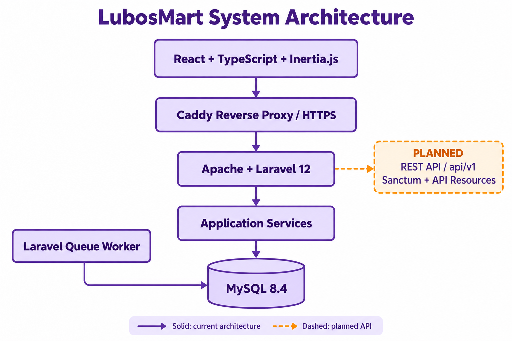

<p align="center">
  
</p>

# LubosMart

**A Community-Focused E-Commerce and Logistics Management Platform**

LubosMart is an e-commerce and delivery management platform for Filipino communities. It connects buyers, sellers, couriers, sorting centers and administrators in one system, covering product discovery, cash-on-delivery checkout and parcel fulfillment.

**Live application:** [lubosmart.app](https://lubosmart.app)

## Technology Stack

| Layer | Technologies |
| --- | --- |
| Front End | React 19, TypeScript, Inertia.js 2, Tailwind CSS 4, Radix UI, Headless UI |
| Backend | Laravel 12, PHP 8.3 in Docker, Apache, Laravel Socialite |
| Database | MySQL 8.4 in Docker Compose, Eloquent ORM |
| Build and Testing | Vite 6, Node.js 22, Composer, Pest, GitHub Actions |
| Deployment | Docker Compose, Caddy; Azure Ubuntu VM and Cloudflare DNS documented in the deployment setup |

## Features by Role

| Role | Main Functions |
| --- | --- |
| Buyer | Browse and search products, manage cart and addresses, place COD orders, track deliveries and contact sellers/support |
| Seller | Manage listings, prices and stock; prepare orders, print waybills, follow shipments and review sales |
| Rider / Courier | Handle assigned pickups and deliveries, update parcel status, upload proof of delivery and confirm COD collection |
| Sorting Center | Review couriers, manage shipping coverage/rates, receive and sort parcels, assign deliveries and receive COD handovers |
| Admin | Review applications, manage account restrictions, monitor seller compliance, resolve complaints, reconcile COD and manage reports/platform content |

Public accounts require email verification and application approval before operational access. Admin reviews buyer, seller and sorting-center applications; sorting centers review their couriers. Email/password and Google sign-in are supported.

## How the System Works

A buyer's checkout creates separate orders for each seller. Sellers prepare the parcels, sorting centers coordinate pickup and dispatch, and couriers complete delivery with proof and COD collection. Sorting centers receive the cash; Admin performs final reconciliation.



Solid arrows show the current architecture. The dashed branch shows the planned REST API with Sanctum and API Resources.

The application uses a Laravel modular monolith: one backend owns the account, commerce, logistics and administration modules. Inertia connects React pages and forms to Laravel. Checkout preserves order details, checks stock and protects against duplicate submissions. Queue workers process operational notifications.

## Local Development

Requirements: PHP 8.2+ with required extensions, Composer 2, Node.js 22/npm and a configured database. The example environment defaults to SQLite; MySQL can be configured through the database settings.

For a new installation:

```powershell
git clone https://github.com/carlmatthewcastro/lubosmart-app.git
cd lubosmart-app
composer install
npm ci
Copy-Item .env.example .env
php artisan key:generate
```

Configure the database and SMTP settings in `.env`, then start the application:

```powershell
php artisan migrate
php artisan db:seed --class=MarketplaceCategorySeeder
composer run dev
```

Open `http://localhost:8000`. Google sign-in requires OAuth credentials and a matching callback URL. Real verification emails require working SMTP settings. Preserve an existing `.env` and application key when updating an installation.

Run tests and build assets with:

```powershell
php artisan test
npm run build
```

## Project Status

Current source includes account onboarding and approvals, marketplace shopping, seller fulfillment, courier/sorting-center operations, support and administration. Payments are COD only. Variants, vouchers, ratings and complete returns/payout accounting remain outside the implemented scope.

**Planned:** a versioned Laravel REST API under `/api/v1` with Laravel Sanctum, API Resources and OpenAPI documentation. The migration will retain existing web routes and share business logic between web and API controllers.

## Deployment

The documented production setup uses Docker Compose on an Azure Ubuntu VM, with Caddy providing HTTPS and Cloudflare handling DNS. MySQL and uploaded files use persistent volumes. Live infrastructure settings require separate verification.

Releases are deployed manually after review and merge to `main`. GitHub Actions provides test/build checks. Deployment includes database/upload backups, migrations, worker updates and health checks; preserve production credentials, the application key and persistent data.

## Documentation

The [documentation guide](documentation/README.md) covers Tech Stack → Functions → Front End → Backend → Database → API → Deployment.
