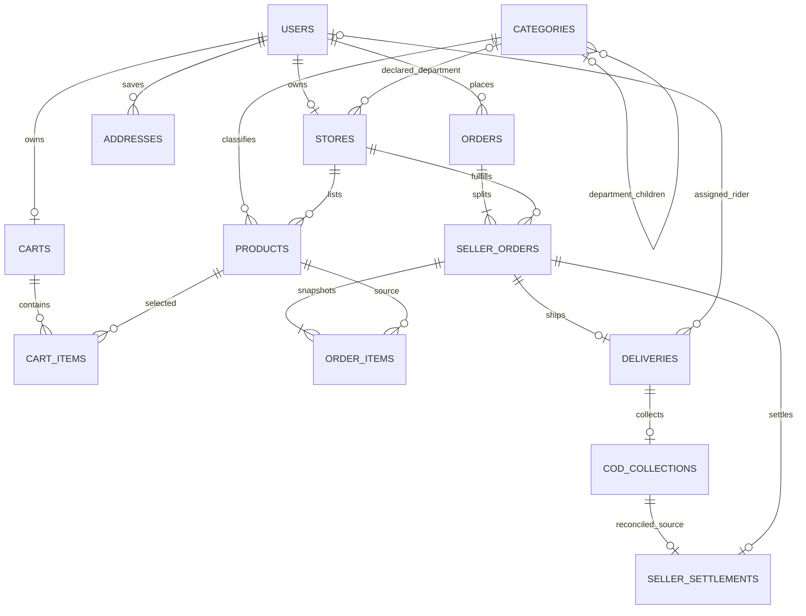
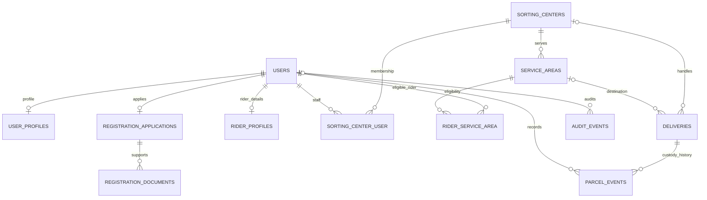

# Core Schema ERD: Marketplace Database

Canonical filename: **`core-schema-erd.md`**. Reviewed on 2026-10-06 against repository migrations, including the updated ITEP product taxonomy and commission/registration/logistics additions. This document describes the schema after migrations, not a promise that every operational screen/action exists. See [business rules](business-rules.md) for implementation status and limits.

This schema supports a multi-seller ecommerce MVP. A buyer can check out a cart containing products from multiple stores. The checkout is one parent order, split into one seller order and one delivery per store.

Laravel also creates framework-support tables such as `password_reset_tokens`, `sessions`, `cache`, `cache_locks`, `jobs`, `job_batches`, `failed_jobs`, and `migrations`. Those are not marketplace tables.

## Order lifecycle

```text
buyer
  └── order (one checkout; shipping address is snapshotted)
       ├── seller order (one per store)
       │    ├── order items (product name and price are snapshotted)
       │    └── delivery (one per seller order)
       └── seller order ...
```

The unique constraint on `(order_id, store_id)` prevents duplicate seller orders for the same store in one checkout. A unique `deliveries.seller_order_id` enforces the MVP rule of one package per seller order. These can be relaxed later if the product needs split packages.

## Tables

### users

All account roles share Laravel's `users` table.

- `id` primary key
- `role`: `buyer`, `seller`, `admin`, `logistics`, or `rider`
- `name` (160), unique `email` (160), hashed `password`
- `phone` (30), nullable
- `status`: `active`, `pending`, or `suspended`
- Laravel authentication fields: `email_verified_at`, `remember_token`, timestamps
- unique nullable `google_id` for the existing Socialite integration

The existing public registration still defaults users to active; the new application table does not automatically change this behavior. Pending onboarding, private-document review, approval and suspension enforcement are implemented. New public accounts explicitly receive pending status; existing active accounts are preserved.

### stores

One storefront per seller account.

- `user_id` is a unique FK to `users`
- `name` (160), nullable `description`, `status`: `pending`, `approved`, or `rejected`
- timestamps
- nullable `business_category_id` FK to a root category (application must enforce root selection)

Legacy stores retain null business category until reviewed. Checkout enforces declared-department compliance when set; catalog-write/onboarding validation remains pending.

The database does not enforce that `user_id` belongs to a user whose role is `seller`; the application must enforce that.

### categories

Hierarchical taxonomy sourced from `ITEP 308 CATEGORIES.pdf`: **14 departments and 83 subcategories**. See the complete [ERP taxonomy](erp-categories.md).

- `name` (100), nullable `parent_id` self-FK with restricted deletion
- nullable unique `slug` (220); canonical child slugs include the department
- `sort_order` and `is_active`; timestamps
- unique `(parent_id, name)` permits repeated labels in different departments

Canonical departments have no parent; subcategories reference their department. The seeder preserves existing IDs/custom categories and adopts matching legacy roots. Legacy slugs may remain null. Depth/cycle validation and root-name validation need application controls; self-FKs/nullable-parent uniqueness do not enforce those rules. Checkout checks category/parent availability.

### carts

One cart per buyer, created as needed. `user_id` is a unique FK to `users`.

### addresses

Saved buyer delivery addresses:

- `user_id` FK, `label`, `recipient_name`, and `phone`
- `line1`, optional `line2`, `barangay`, `city`, `province`, `region`, and `zip`
- `is_default` and timestamps

The database cannot guarantee that `is_default` is true for at most one address per user with a portable simple constraint; address-management logic must maintain that rule.

### products

Each product belongs to one store and one category.

- FKs: `store_id`, `category_id`
- `name`, nullable `description`, `price` (`decimal(10,2)`), unsigned `stock`
- nullable `image_path`, `status`: `active` or `hidden`
- indexes for category/store product listings by status; timestamps

Hide products rather than hard-delete them once they have been ordered. The order item FK intentionally protects historical references.

### cart_items

- FKs: `cart_id`, `product_id`
- unsigned `quantity`
- unique `(cart_id, product_id)`: adding the same product updates quantity instead of creating a duplicate row

### orders

One row per buyer checkout:

- `buyer_id` FK to `users`
- nullable `address_id` FK to `addresses` with `nullOnDelete`
- immutable shipping snapshot: recipient name/phone and address lines, barangay, city, province, region, and zip
- `payment_method`: `cod` for the MVP
- `subtotal`, `shipping_total`, and `total` (`decimal(10,2)`)
- aggregate `status`: `pending`, `processing`, `completed`, or `cancelled`
- timestamps and an index on `(buyer_id, created_at)`

The snapshot is authoritative for fulfillment. Editing or deleting a saved address must not alter an old order. The nullable FK only identifies the source address while it still exists.

`orders.status` is the buyer-facing summary of its seller orders; application logic must keep it consistent with the child records.

### seller_orders

One row per store participating in a checkout:

- `order_id` FK to `orders`, `store_id` FK to `stores`
- unique `(order_id, store_id)`
- snapshotted `subtotal` and `shipping_fee` (`decimal(10,2)`)
- nullable `commission_basis_points`, `commission_amount`, `seller_proceeds`; new checkout snapshots them, legacy orders stay null
- seller fulfillment `status`: `pending`, `processing`, `shipped`, `completed`, or `cancelled`
- timestamps and an index on `(store_id, status)`

This is the seller's fulfillment boundary. Different stores in the same checkout can progress independently.

Default commission is 1000 basis points (10%) of item subtotal, excluding shipping, rounded half-up once per seller order. Seller proceeds exclude shipping allocation. Snapshot amounts do not mean a payout has occurred; settlement requires reconciled COD and authorized workflow.

### order_items

Line items belong to a seller order, not directly to the parent checkout:

- `seller_order_id` FK to `seller_orders`
- `product_id` FK to `products`
- `product_name` and `price_each` snapshots
- unsigned `quantity`
- unique `(seller_order_id, product_id)`

The application must verify that each product belongs to the store on its seller order. `price_each` is the checkout-time price; later product price changes do not affect completed orders.

### deliveries

One delivery per seller order for the MVP:

- unique `seller_order_id` FK to `seller_orders`
- nullable `rider_id` FK to `users`
- `status`: `unassigned`, `assigned`, `picked_up`, `in_transit`, `delivered`, or `failed`
- nullable `proof_photo_path`, `picked_up_at`, `delivered_at`, and timestamps
- nullable `sorting_center_id` and `service_area_id` FKs for compatible rollout

The application must verify that the assigned account has the `rider` role. The delivery status tracks transport; the seller order status tracks seller fulfillment.

### commerce_settings

The singleton row `id=1` stores `shipping_fee_per_seller_order` (initial `50.00`) and `platform_commission_basis_points` (initial `1000`, or 10%). Checkout uses persisted values and rejects commission outside 0–10000 basis points. Future admin updates need authorization, audit and range validation; browser-supplied amounts are never authoritative.

## Registration, logistics and accounting foundations

The new tables below provide storage. No approval, scan/dispatch, collection or settlement endpoints/actions are introduced by these migrations. Role/status checks, state transitions, document privacy and cross-table consistency must be enforced when those workflows are implemented.

| Table | Fields and relationship rules |
| --- | --- |
| `user_profiles` | Unique user FK; first/last name, optional middle initial, sex/birthday, timestamps; age derived at runtime; contact remains `users.phone`, addresses remain `addresses` |
| `registration_applications` | Unique user FK (one current application); requested buyer/seller/rider/logistics role; draft/submitted/approved/rejected status; reviewer, reason, business name, center/address FKs, policy acceptance and decision timestamps |
| `registration_documents` | Application FK; kind, private disk/path, MIME, byte size, timestamps; default `local` disk; upload authorization and retention required |
| `rider_profiles` | Unique user FK; vehicle type, optional plate, availability default false; license/OR/CR use application documents |
| `sorting_centers` | Unique code, name, address, phone, active flag |
| `service_areas` | One center FK per area; unique area code; province/city/optional barangay codes, name, active flag; geographic lookup index |
| `sorting_center_user` | Center/staff user, granting user, timestamps; unique center/user membership |
| `rider_service_area` | Rider/area FKs, timestamps; unique rider/area eligibility |
| `parcel_events` | Delivery, optional center, actor, type, globally unique request/reference, notes, occurred timestamp; delivery/time index |
| `cod_collections` | Unique delivery and reference; rider, amount; collected/handed_over/reconciled status; receiving/reconciling users and timestamps |
| `seller_settlements` | Unique seller order, collection and reference; approving user, amount, settled timestamp; one final settlement per package |
| `audit_events` | Optional actor, subject type/ID, action, safe JSON changes and occurred timestamp; subject/time index; subject reference is application-managed |

Financial, custody and review FKs generally restrict deletion, preserving operational references. Audit rows are append-only by application convention, not database triggers. Customer anonymization/retention needs a deliberate process rather than cascaded deletion.

Current limitations: service areas belong to one center; overlapping geographic coverage must be validated in administration. A settlement's collection must belong to the seller order's delivery, be reconciled for the full package amount, and match snapshot proceeds; FKs alone do not establish that. Collection implies a completed collection event, so no row means uncollected. Multiple attempts, split payouts, partial refunds, adjustment ledger, separate pickup tasks and detailed assignment history remain future schema work. Do not treat these foundation records as a complete financial ledger.

## Entity relationship diagrams





These diagrams describe business relationships; they omit secondary reviewer/granter/recipient FKs for readability. A database FK cannot guarantee that an order actually has at least one child or a rider's user role is correct; transactional actions maintain those invariants.

## Checkout integrity rules

`CreateOrderFromCart` runs checkout in one database transaction. It reloads and locks the buyer account, cart, product rows in ascending product ID order, and participating stores in ascending ID order. It validates that the buyer owns the address and the products are active and from approved stores, checks available stock, and conditionally decrements each stock quantity. A failure rolls back the order, seller orders, order items, deliveries, stock changes, and cart clearing together.

The parent order subtotal is the sum of checkout-time prices times quantities. Each seller order stores its item subtotal, configured shipping fee and commission snapshot. `orders.shipping_total` is fee multiplied by store count; `orders.total` is subtotal plus shipping, without an extra commission charge. Integer centavos prevent floating-point rounding errors; centavo remainders are left-padded correctly. After checkout, cart items are removed and the cart remains reusable.

## Migration workflow

The user/support migration creates `users` before any table references it. The marketplace migration then creates tables in foreign-key dependency order.

For an empty, disposable local database, rebuild the schema with:

```sh
php artisan migrate:fresh
```

This command drops every table in the selected database. Never run it against a database containing data to keep or against production. Use `php artisan migrate` for normal additive changes and production deployments.

Apply the new migrations and taxonomy import on an existing local database with:

```powershell
php artisan migrate
php artisan db:seed --class=MarketplaceCategorySeeder
```

Production uses the equivalent Docker commands with `--force` after backup and release review. Do not use the generic `DatabaseSeeder` in production: it also creates a demo user. Slug-less legacy categories and null store departments require explicit mapping/review. Historical orders retain null commission fields; never backfill them with today's rate automatically.

The hierarchy migration refuses rollback when repeated category names would violate the old global-name constraint. Resolve/review duplicates before any rollback; the migration does not silently delete categories. Rolling back populated foundation or commission changes discards operational records/snapshots; use forward fixes in production.

COD remains the only payment method. Ratings, variants, wishlists, vouchers, returns and accounting adjustments are scoped in [business rules](business-rules.md), with required future schema/actions clearly listed. Order conversations and authorized admin rate settings now have connected screens.

## 2026-10-07 registration schema extension

An additive migration extends registration_applications.requested_role to include logistics and adds nullable business_name, sorting_center_id and address_id. user_profiles adds province_code, city_code and barangay_code. Parent selections are resolved server-side. Applications reference their registration address; original order shipping snapshots are preserved. Rider applications use sorting_center_id for review isolation. Logistics approval creates a center and sorting_center_user grant. Down migration refuses narrowing the role enum while logistics applications exist; rollback otherwise removes the new profile/address metadata. Prefer forward fixes after real applications exist.

## 2026-10-07 marketplace UI extension

`orders.checkout_key` is a nullable UUID with a unique buyer/key pair. HTTP checkout locks the buyer and reuses an existing order for the same key, preventing retry duplication. `order_messages` stores a seller-order FK, sender user FK, body, and timestamps; only that parcel’s buyer/seller can write messages. Both FKs restrict deletion so conversation context is retained. Proof photos remain on the private disk; product photos use public storage. Approved riders receive sorting-center membership for dispatch authorization. See [UI workflow](ui-workflow.md) for the connected screens and current limits.
