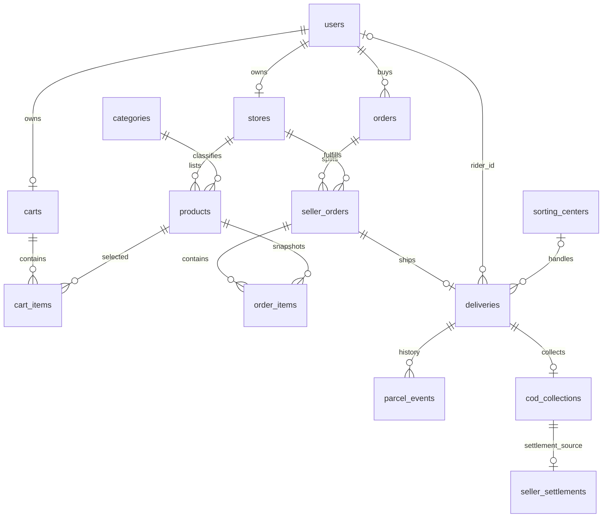

# Database

Docker Compose specifies MySQL 8.4. Laravel uses Eloquent and Query Builder; migrations define the schema. `.env.example` and automated tests use SQLite, so they do not prove production MySQL concurrency behavior.

## Main tables

| Area | Tables and relationships |
| --- | --- |
| Accounts | `users`; one profile, rider profile and registration application per user; application drafts/documents |
| Catalog | One `stores` record per seller; `categories` with parent/child hierarchy; `products` reference store/category and hold stock |
| Shopping | One `carts` record per buyer; `cart_items` link products/quantities; user-owned `addresses` |
| Orders | `orders` reference buyer/address; `seller_orders` split by store; `order_items` snapshot product names/prices |
| Delivery | One `deliveries` record per seller order; optional rider, center and area; `parcel_events` record history |
| Centers | `sorting_centers`, `service_areas`, `shipping_rates`; `sorting_center_user` and `rider_service_area` memberships |
| COD | One `cod_collections` record per delivery; `seller_settlements` provides settlement storage, not a complete payout workflow |
| Administration | `audit_events`, `product_moderations`, `platform_contents`, `commerce_settings` |
| Support | `order_messages`, `support_cases`, participants, messages and read cursors |
| Infrastructure | Sessions, verification/security challenges, jobs, cache and locks |

Business tables generally use bigint `id` primary keys and declared foreign keys. `commerce_settings` uses a singleton tinyint key. Composite uniqueness protects cart/product pairs, order/store splits and memberships. Audit subjects and support read-message IDs are application-managed references, not declared foreign keys.

## Core relationships



This diagram shows the main migration-defined relationships; secondary reviewer/actor links are omitted. Foreign keys allow empty child collections; checkout creates the required order items/splits transactionally.

## Data rules and maintenance

Checkout creates orders, deducts stock and clears the cart in one transaction. It preserves prices, shipping addresses, quotes and commission rates. Unique buyer/checkout keys prevent retry duplication. Cancellation is allowed while all order parts remain pending and restores stock.

The role is stored on `users`; there is no separate role pivot. Current roles are `buyer`, `seller`, `courier`, `sorting_center`, `admin`. Historical names such as `rider_profiles` and `deliveries.rider_id` remain in the schema.

```powershell
php artisan migrate
php artisan db:seed --class=MarketplaceCategorySeeder
```

The taxonomy seeder supplies 14 departments and 83 subcategories. Avoid the generic demo seeder in production. Several account migrations are forward-only. Back up the database and private uploads before production changes; see [Deployment](../deployment/README.md).

Source: `database/migrations/`, `database/seeders/`, `app/Models/`, `config/database.php`. Database cache/session/queue defaults exist; no Redis service or external connection pool is configured.

[Documentation](../README.md)
