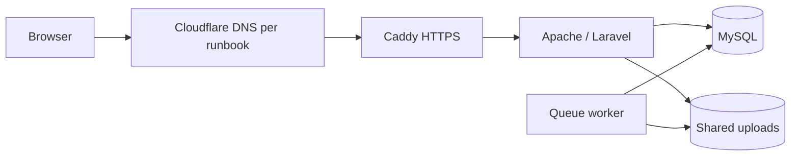

# Deployment and Local Setup

The repository describes production on an Azure Ubuntu VM with Docker Compose and Cloudflare DNS. Live VM/DNS settings, deployed versions, Cloudflare proxy/WAF/cache features and backup execution are unverified. Deployment is manual; GitHub Actions builds/tests do not deploy the VM.

## Local setup

Requires PHP 8.2+ with required extensions, Composer 2, Node.js 22/npm and a configured database. From a new checkout:

```powershell
composer install
npm ci
# New installation only; preserve an existing environment and application key.
Copy-Item .env.example .env
php artisan key:generate
```

Configure your database privately. `.env.example` defaults to SQLite; for MySQL set `DB_CONNECTION=mysql`, host/port and your local database credentials. Then:

```powershell
php artisan migrate
php artisan db:seed --class=MarketplaceCategorySeeder
composer run dev
```

Open `http://localhost:8000`. The development script starts Laravel, Vite, a queue listener and log monitoring. On Windows use `PHP_CLI_SERVER_WORKERS=1` if the PHP development server reports an unsupported-fork warning.

## Email and Google configuration

Set `MAIL_MAILER=smtp` and `MAIL_SECURITY_MAILER=smtp` with your provider's credentials and authorized sender. For Gmail, the existing guide uses `MAIL_HOST=smtp.gmail.com`, `MAIL_PORT=587`, `MAIL_SCHEME=smtp`, `MAIL_ENCRYPTION=tls` and an App Password. Keep the username, sender and reply-to consistent with the authorized mailbox. Never use a log mailer for real security codes.

```powershell
php artisan config:clear
php artisan lubosmart:mail-status --check-connection
```

A successful connection does not prove inbox delivery; test an actual registration. Security emails send synchronously; approval/status emails require the queue. `APP_URL` must be reachable from the device opening verification links.

Google sign-in uses private `GOOGLE_CLIENT_ID`, `GOOGLE_CLIENT_SECRET` and an exact `GOOGLE_REDIRECT_URI`: locally `http://localhost:8000/auth/google/callback`, production `https://lubosmart.app/auth/google/callback`. Use the same hostname throughout login and register the callback in the provider.

## Production services

| Service | Role | Storage |
| --- | --- | --- |
| `app` | PHP 8.3/Apache Laravel image; Node 22 builds assets in an earlier stage | `app-storage` |
| `queue` | Shared image, operational notification worker | Shared `app-storage` and database jobs |
| `db` | MySQL 8.4, internal network, ping health check | `mysql-data` |
| `caddy` | Public HTTPS, compression and reverse proxy to `app:80` | `caddy-data`, `caddy-config` |



Only Caddy publishes ports. Caddy manages origin certificates; Apache runs PHP behind it. MySQL and uploads survive container recreation through named volumes. No Nginx, Redis, SSR or scheduler service is defined in Compose.

## Release steps

Review/merge to `main`, connect through your established SSH access, and retrieve the approved release. Preserve production credentials and `APP_KEY`. Verify database/private-upload backups stored outside Docker volumes and copied off the VM before migrations.

Run in the VM checkout; stop if any command fails:

```bash
git status --short
git switch main
git pull --ff-only origin main
docker compose config --quiet
docker compose build app
docker compose exec app php artisan down --retry=60
docker compose stop queue
docker compose up -d --no-deps --force-recreate app
docker compose exec app php artisan optimize:clear
docker compose exec app php artisan migrate --force
docker compose exec app php artisan optimize
docker compose exec app php artisan lubosmart:mail-status --check-connection
docker compose up -d --no-deps --force-recreate queue
docker compose exec app php artisan up
docker compose ps
curl -I https://lubosmart.app/up
```

Production requires `APP_ENV=production`, `APP_DEBUG=false`, HTTPS `APP_URL`, secure cookies and MySQL `DB_HOST=db`. Keep `.env` private. Do not expose database port 3306. Arrange `schedule:run` every minute for the existing daily cleanup; live scheduling is unverified.

Check queue/logs, real email, login and role journeys after release. Keep a compatible previous image/revision for recovery; several account migrations cannot be rolled back. Never run `migrate:fresh`, demo/test-account seeders or `docker compose down -v` in production. Restore tested database/uploads together when recovery requires it.

Sources: `Dockerfile`, `docker-compose.yml`, `Caddyfile`, `.github/workflows/`, `routes/console.php`.

[Documentation](../README.md)
