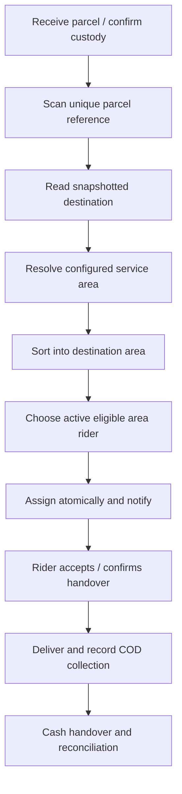

# Logistics and sorting center operations

The `logistics` role represents staff; a center is an organizational entity. Tables include `sorting_centers`, `service_areas`, `sorting_center_user`, `rider_service_area`, `parcel_events`, `cod_collections` and `seller_settlements`. Registration, center-scoped rider review/membership, parcel receipt, rider assignment, delivery proof, COD receipt, and admin reconciliation now have connected screens. Service-area automation, barcode scanning, and seller payouts remain proposed. See [UI workflow](../design/ui-workflow.md).

## Registration and ownership

ERP-Components-updated-1.pdf page 5 supersedes the earlier invitation-only plan. Logistics submits a public pending application with business details, identity and business/DTI permit. Admin approval creates its center and membership. Pending logistics cannot perform operations. Riders select an active center during application; only active, verified logistics staff assigned to that center can approve/reject them or manage approved riders. Admin reviews buyer/seller/logistics applications; rider review belongs to logistics. Service areas and parcel workflows remain separate work.

## Schema mapping and future extensions

| Entity | Purpose / key constraints |
| --- | --- |
| Sorting centers | Name/code, location, contact and active status |
| Center memberships | User FK, center FK, permission/grant metadata; unique membership |
| Service areas | Stable geographic codes and parent hierarchy; active/serviceable flag |
| Center service areas | Implemented as `service_areas.sorting_center_id` (one center per area); transfer/overlap rules require application validation |
| Rider service areas | Eligible active rider and area/center; reviewed grant |
| Parcel events | Existing delivery FK, center/actor, event type, timestamp and unique scan/request reference |
| Delivery assignments | Current assignment remains `deliveries.rider_id`, plus new center/area FKs; stage/acceptance/history task records remain future work |
| Pickup tasks | Future separate tasks distinguish seller pickup from final delivery; required before both source workflows are supported |

Keep the current one-delivery-per-seller-order constraint for MVP. Extend it only when split packages/multiple delivery legs are deliberately designed. Use append-only events for sorting/custody detail rather than treating the existing six delivery statuses as a complete event history.

See [Core Schema ERD](../architecture/core-schema-erd.md) for actual table names/constraints. Parcel-event references, collection delivery/reference fields and settlement source/reference fields are unique; authorized actions still need to enforce matching parcel/area, state, full collected amount and reconciliation before settlement.

## Parcel lifecycle

1. Identify the seller order/delivery from the internal parcel reference. Scanning a code must load an authorized record, not accept arbitrary parcel fields from the scanner.
2. Record physical receipt, actor, center and timestamp. Duplicate scans are idempotent. Verify parcel/custody before advancing.
3. Use the order's shipping snapshot; changing a buyer's saved address cannot reroute an existing parcel.
4. Resolve stable province/city/barangay codes against database service areas. Unmapped destinations enter an exception queue; do not assign a default rider silently.
5. Sort and select an active, approved, center/area-eligible rider with availability. No eligible rider leaves the parcel awaiting assignment with a visible reason.
6. Lock the task/current assignment in a transaction, verify expected state and allocate once. For eligible pickup acceptance, the first successful transaction wins; later requests receive an unavailable result.
7. Notify the rider after commit. Assignment is operational only when the correct rider can see and acknowledge it; retry notification independently.
8. Confirm handover and custody, then transport. Reassignments require authorization/reason and cancellation of the old assignment; the old rider loses write access immediately.
9. Record evidence and COD collection; handle refusal, unavailable recipient or damage without marking delivered. Cash reconciliation follows [business rules](../product/business-rules.md).

## Boundaries and reporting

Center staff see their center's tasks. Riders see eligible pickup summaries and their assigned deliveries, with customer details limited to operational need. Sellers see their shipments; buyers see their own tracking. Reports use these same query scopes; an unfiltered export can leak another center's transactions.

Report pending/aged parcels, dispatch counts, failed deliveries, rider activity, expected/collected/handed-over cash and reconciliation discrepancies. Commission reports derive from the accounting ledger, not parcel count. Future chat and account management reuse the same permissions. Never hardcode the sample Area A/B/C or Rider 01/02/03 from the PDF.
