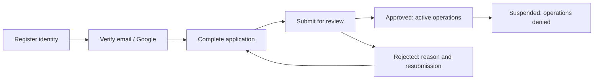

# Registration and authentication

**Target design; gaps below are not implemented by these documents.** Use one `users` table and Laravel's session-based `web` guard. Server-owned role grants authorize operations. Google establishes identity, independently of business approval.

## Role boundaries

| Role | Entry and approval | Operational scope |
| --- | --- | --- |
| Buyer (`buyer`) | Public local/Google application; admin review per PDF | Own addresses, cart, COD orders and complaints |
| Seller (`seller`) | Public application, pending store; admin account/store review | Own approved store, products, seller orders and reports |
| Rider (`rider`) | Public application plus vehicle/documents; admin review | Eligible pickups, assigned deliveries, own cash handovers/history |
| Logistics/Sorting Center (`logistics`) | Admin invite/provisioning and center assignment | Parcels, dispatch, area assignments and reports for assigned center |
| Admin (`admin`) | Trusted bootstrap; later admin invitations | Account/store decisions, settings/categories, disputes and audits |

Hide Admin/Logistics from public choices and reject direct submissions of these values. Public handlers cannot accept `status`, approval timestamps, reviewer, center membership or permissions. Existing public role allowlists already reject privileged roles; preserve them.

Retain one role per account initially. If sellers/riders need to buy, decide that explicitly: current checkout expects a buyer. Never overwrite an existing role during login, Google linking or UI tab switching.

## Separate identity, access and review state

1. Identity: `email_verified_at` records verification.
2. Access: existing `users.status` = `pending`, `active`, `suspended`.
3. Review: proposed `registration_applications.status` = `draft`, `submitted`, `approved`, `rejected`.

New public users are pending with a draft application. Submission requires verified email and completed role fields. Admin approval activates the account and application atomically; sellers also require approved store status. Rejection leaves access pending and allows correction/resubmission. Suspension denies operations even after verification/store approval; reinstatement is audited.

Pending users can authenticate, verify, complete onboarding, see decisions, recover credentials and log out. They cannot check out, publish, accept deliveries or dispatch. Check status on every protected request, including existing sessions.

## Additive schema foundations and remaining work

The new foundation migration now creates `user_profiles`, `registration_applications`, `registration_documents`, `rider_profiles` and `audit_events`, plus logistics/COD storage described in [Core Schema ERD](core-schema-erd.md). Controllers do not yet populate or review these records; this remains a target workflow, not an enabled approval feature. Preserve deployed migrations and use additive changes.

| Addition | Fields/constraints |
| --- | --- |
| Profile (`user_profiles`) | Unique user FK, name parts, birthday, sex; phone remains on `users`; define display-name derivation |
| Registration application (`registration_applications`) | Unique user FK, requested public role, review status, submission/review timestamps, reviewer FK, rejection reason, policy acceptance |
| Application documents (`registration_documents`) | Application FK, kind, private disk/path, MIME/size and timestamps |
| Rider profile | Unique user FK, vehicle type, plate number, document references and eligibility |
| Center membership | User/center FKs and grant metadata; see sorting guide |
| Audit events | Actor, subject, action, previous/new state and timestamp; exclude credentials/raw documents |

Use one current application per user initially; audit resubmissions. If storing application history as rows, prevent multiple open applications transactionally. Plan existing-account backfill before changing defaults; do not blanket-activate/demote them. Existing `google_id` is nullable/unique; Google-only accounts currently receive a random hashed password, never a shared default.

Use a cached/imported geographic dataset with stable codes and validated province/city/barangay hierarchy. Do not trust labels alone. Store birthday as a date, calculate age for display, and preserve checkout's immutable shipping snapshots.

## Step-by-step implementation

1. Centralize role/status enums and the server's public role options. Update comparisons, factories and tests together when introducing enum casts.
2. Apply the existing foundation migrations. Wire profiles/applications/documents/audits into registration; explicitly set new accounts pending and review existing account migration. Validate `stores.business_category_id` against a root from the [course taxonomy](erp-categories.md).
3. Extract shared validation into Form Requests and a registration/onboarding action. Existing controllers validate inline; refactor both related registration paths together.
4. Implement `MustVerifyEmail` on User, configure mail, retain verification endpoints and protect operations with `verified`. Keep onboarding/status/recovery reachable.
5. Regenerate sessions after local registration; password login and Google callback already do. Preserve CSRF, logout invalidation and reset flows.
6. Add active-account middleware and role gates; use policies for buyer ownership, store ownership, rider assignment and center membership. Authentication alone does not authorize record access.
7. Build admin review actions with transactions and expected-state checks. Competing decisions cannot both succeed. Audit changes and send notifications after commit, with retryable delivery.
8. Provision the first admin with a dedicated console command and interactive credentials. No default password seed or public bootstrap route. Invitations expire, are single-use and bind email/role/center.
9. Add onboarding/status pages and a shared authorized dashboard destination resolver. Check intended URLs against role permissions to prevent loops/wrong-role destinations.
10. Share React form components between homepage modal and dedicated login/register pages. Render errors, submission progress, review state and Google cancellation consistently.

Suggested future route names: `onboarding.edit`, `applications.store`, `applications.show`, `admin.applications.index`, `admin.applications.approve`, `admin.applications.reject`. They do not exist yet.

## Security and current gaps

Normalize email consistently without casually rewriting existing identities. Use Laravel hashing/password defaults. Rate-limit registration, OAuth initiation, password recovery and verification resend; password login already has a limiter. Recovery responses should not enumerate accounts. Do not allow privileged fields in ordinary profile updates.

Keep IDs, permits and proof images private; validate file content/type/size, generate filenames and serve through authorized routes. Define retention and audit access. `storage/app/public` is unsuitable for identity documents.

Current User lacks the verification contract; dashboard requires only `auth`. Password login and Google callback do not enforce suspension. Store approval checks in checkout do not protect all seller operations. Close these before operational release.

Laravel's [verification guide](https://laravel.com/docs/12.x/verification) explains the model contract and middleware. Use [authorization policies](https://laravel.com/docs/12.x/authorization) for resource permissions.
